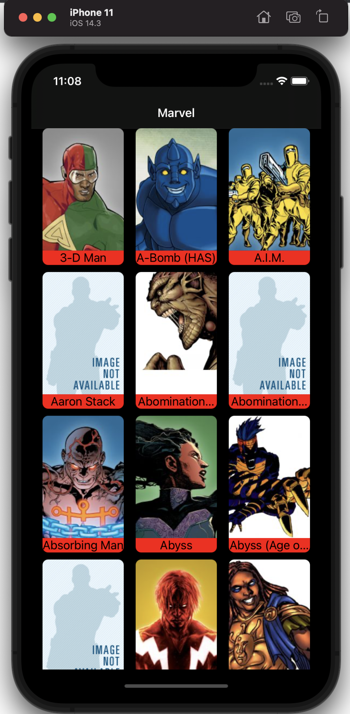
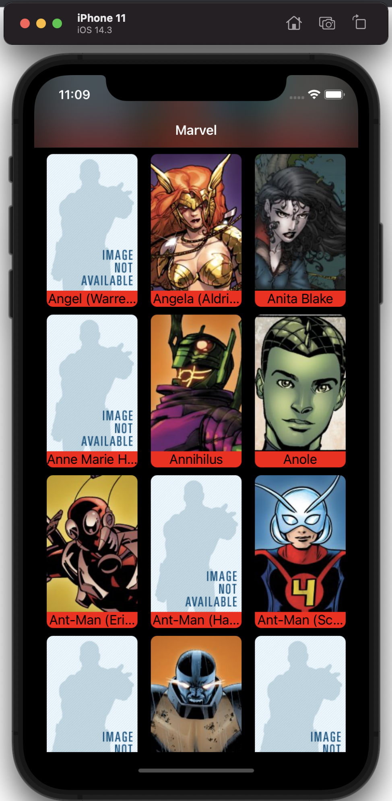
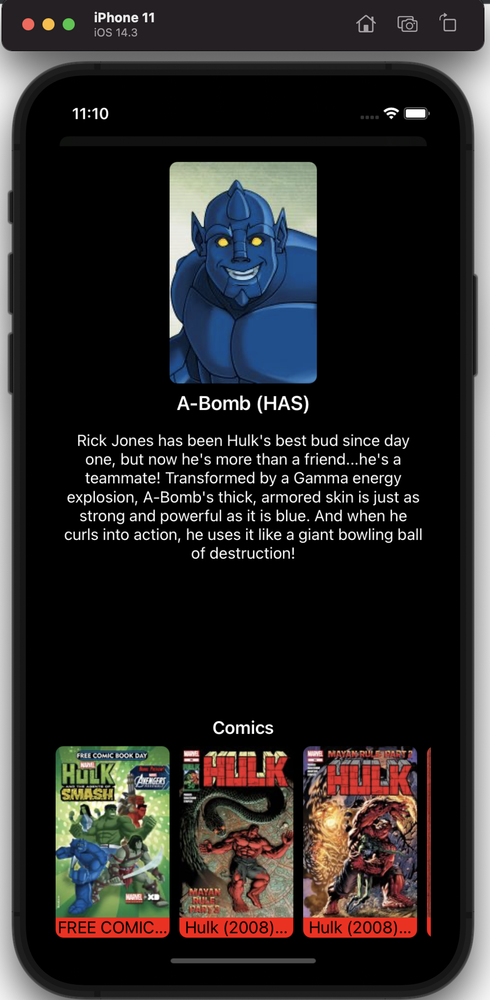
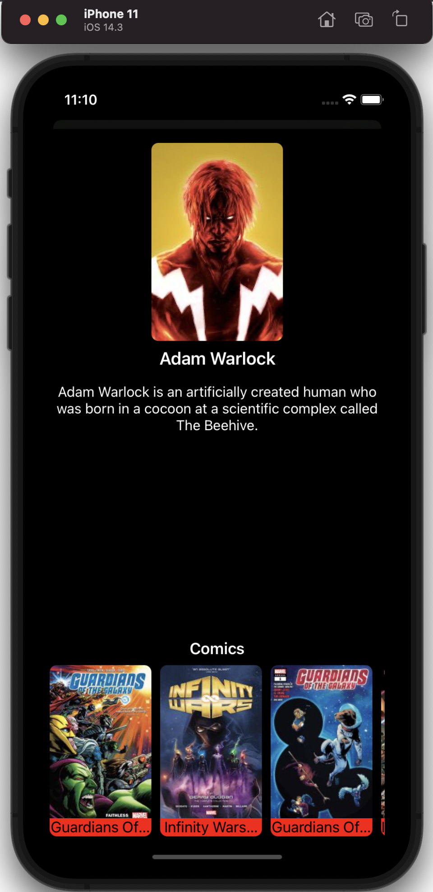

<p align="center">
  
</p>

# Marvel Challenge

This is a technical challenge for a selection process for iOS developer.

## Challenge Description

Create a mobile application using [**Marvel's public API**](https://developer.marvel.com)

The application should list the Marvel characters on a screen with
infinite scroll and detail each character on another screen (it's not necessary to
use all information provided in the API).

### Architecture

In this project I used VIP.

This architecture was born with the intention of taking the weight of ViewControllers and increasing the testability of the code. Each screen is considered a scene which is formed by six components: ViewController, Presenter, Interactor, Worker, Models and Router. The connection between all these components is made using protocols.

For more information on vip architecture visit [**Clean Swift (VIP)**](https://medium.com/@leodegeus7/clean-swift-vip-como-organizar-melhor-nossos-códigos-f06762fc5cc2)

<p align="center">
  <br /><br />
</p>

### Requirements

* Swift 5.0
* Xcode 10.0+
* iOS 13.6+

### Used Libraries

* [**CryptoSwift**](https://github.com/krzyzanowskim/CryptoSwift)

### Screenshots

<table style="width:100%">
  <tr>
    <td></td>
    <td></td>
    <td></td>
    <td></td>
  </tr>
</table>

### Installation

Simply clone this repository or download its zip file to your computer, install its dependencies and run the project in Xcode.

```bash
$ git clone git@github.com:laridtm/challangeMarvel.git
$ cd challangeMarvel
$ open challangeMarvel/challangeMarvel.xcodeproj
```

### Next Steps

* Handle error cases
* Add code marks
* Improve use of constrains with SnapKit library
* Include UITests
* Replace HTTPCliente class with an HTTP library

### Author

| [](https://github.com/laridtm/) | [@laridtm](https://github.com/laridtm/) |
| ------ | ------ |
